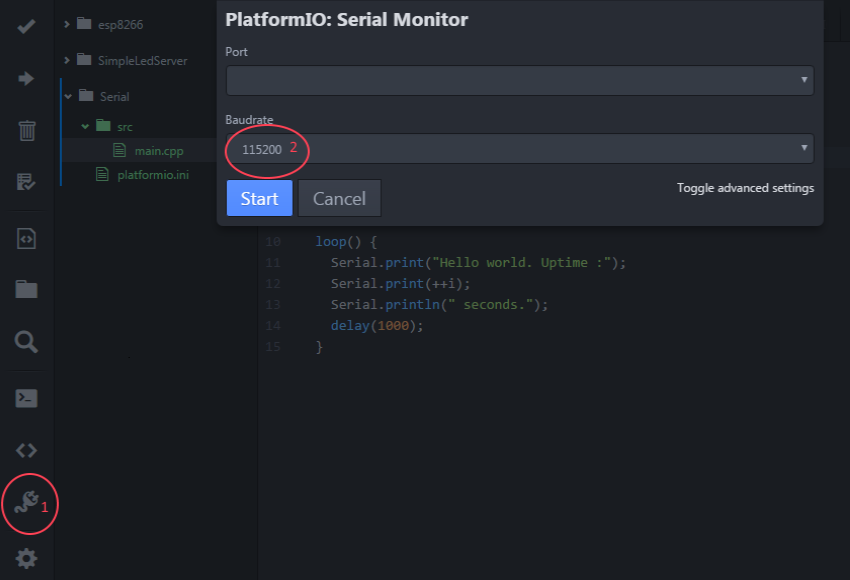

Debug / Utilisation de la liaison Serie
=======================================

Objectif
--------

Avoir un moyen simple de dialoguer avec le micro-controlleur: pour recevoir de l'information (par exemple la value lu par un capteur), envoyer de l'information ou simplement pour essayer de débugger notre programme.

A savoir
--------

Le module ESP8266 dispose de deux connections TX et RX correspondant à la liaison série et qui peuvent être utilisé pour communiquer avec un autre micro-controlleur.
Mais la liaison série est aussi accessible via le port USB, c'est ce que nous utiliserons ici.

La liaison série est également utilisé pour uploader le programme sur le micro-controlleur, il est donc parfaitement normale que la console de platformIO se ferme automatiquement pendant l'upload.

Le code
-------
    #include "Arduino.h"
    int i=0;
    setup() {
        Serial.begin(115200);
        Serial.println("Program start");
    }

    loop() {
        Serial.print("Hello world. Uptime :");
        Serial.print(++i);
        Serial.println(" seconds.");
        delay(1000);
    }

La console dans platformIO
--------------------------

Vous pouvez ouvrir la console dans platformIO en utilisant le bouton en forme de cordon électrique dans le menu de gauche. Puis en choisissant le port et le débit dans la popup.

Le débit doit correspondre à la valuer choisie dans l'appel *Serial.begin()*, tous les exemples de cet atelier seront en 115200 baud.

Les erreurs à éviter
-------------------

### Choisir un mauvais débit
Si la console affiche des caractères étranges, c'est probablement une erreur dans la configuration du débit. Vérifiez le débit configuré lors du Serial.begin() et ajustez la configuration dans platformIO.

### Saturation de la liaison série
Lorsqu'on écrit sur la liaison série avec Serial.print(), on écrit dans un buffer qui sera envoyé progressivement vers l'ordinateur. Mais ce buffer n'est pas infini et si vous écrivez trop, ou trop vite, vous risquez d'avoir des comportements bizare sur votre console. Cela arrive fréquement lorsqu'on oublie de mettre un *delay()* dans la méthode *loop()*.
