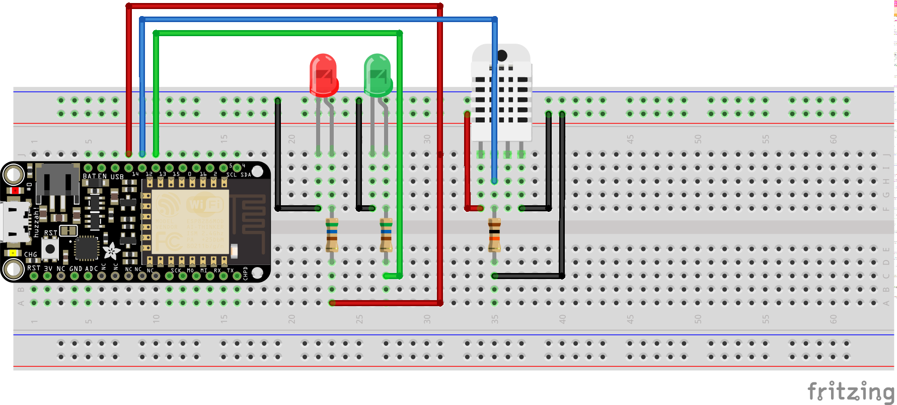

Mon plant care
==============

Prérequis
---------

Avoir fais l'atelier "Temperature sensor"

Objectifs
---------

- Selon la température allume une LED verte ou rouge
- Envoyer les informations de température et d'humidité sur le web site thingspeak
- Visualiser les datas sur son mobile

A savoir
--------

Thingspeak est une plateforme libre de partage data, il permet de collecter, afficher, analyser et automatiser des actions.
Pour communiquer avec thingspeak nous alons envoyer des informations sur l'API de thingspeak.

Le montage
----------

Un capteur de température et deux LEDs.

Le code
-------

	#define SERV       "api.thingspeak.com"
	#define SSID       "******************"
	#define PASSWORD   "******************"

	void SendHttpGet(WiFiClient client, String url, const char* host)
	{
		Serial.println("attempting connection to host: "+ String(host));
		const int httpPort = 80;
		if (!client.connect(host, httpPort)) 
		{
			Serial.println("connection failed");
			return;
		}
		
		client.print(String("GET ") + url + " HTTP/1.1\r\n" +
		"Host: " + host + "\r\n" +
		"Connection: close\r\n\r\n");
		while(client.available())
		{
			String line = client.readStringUntil('\r');
			Serial.print(line);
		}
		Serial.println();
		Serial.println("closing connection");
	}

Les erreurs à éviter
--------------------

### Erreur de polarité: Les LEDs ne s'allument pas
Une LED a un sens, sa borne + (cathode) est la plus longue des deux pattes.
Une LED branchée à l'envers ne s'allume pas (mais n'est pas endommagée), vous pouvez essayer de la retourner.

### Erreur pas de connection wifi: Sur le terminal série je reçois des . (points)
Vérifier votre code lignes 15 et 16, nom du réseau wifi et sont mot de passe.

### Les sur l'API: les données ne se mettents pas à jour sur le site
Vérifier votre code ligne 18 l'API-KEY qui permet d'être authentifier sur le site.
