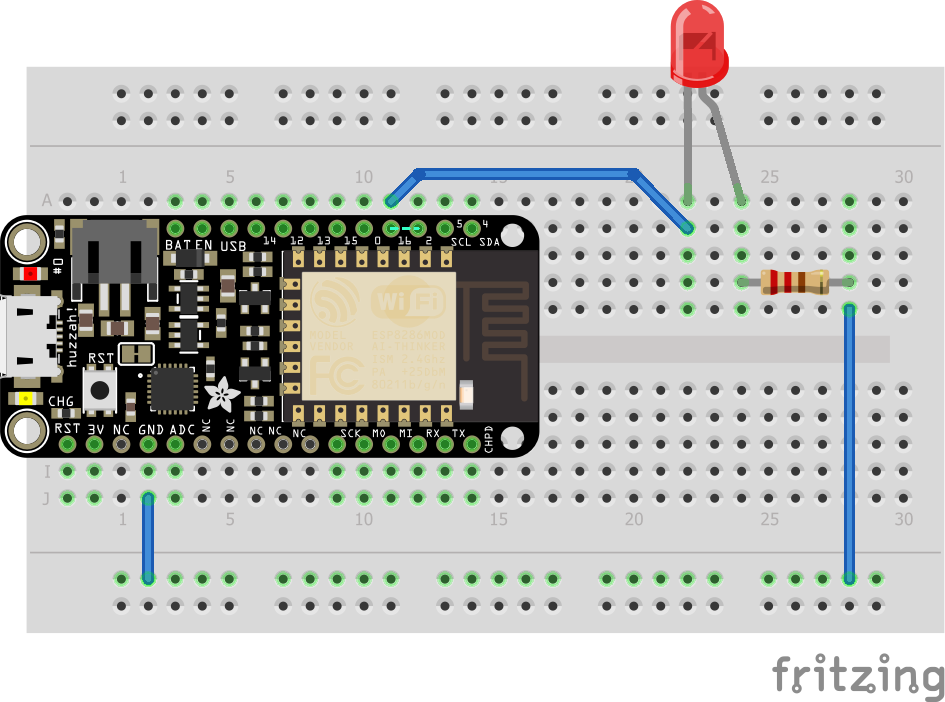

Mon premier montage: Une LED clignotante
========================================

Objectifs
---------

- Faire un premier montage sur la breadboard
- Découvrir la programmation d'un arduino

À savoir
--------

L'ESP8266 peut être programmé de la même manière qu'un arduino, c'est ce que nous allons faire ici avec un premier programme basique. La documentation liée à arduino étant très importante sur Internet, il est généralement très facile de trouver des codes d'exemple pour la majorité des montages simple.

Concrètement, un programme arduino est un programme en C/C++ qui importe "Arduino.h" et qui se compose de deux fonctions:

- **setup()** qui sera exécutée une fois au démarrage du micro-controlleur. C'est-à-dire, lors de sa mise sous tention ou d'un reset.
- **loop()** qui sera appelée en boucle une fois la fonction **setup()** terminée.

L'ESP8266 dispose de plusieurs entrée/sorties (aussi appelées GPIO) numérotées que l'on va pouvoir programmer. Les fonctions utiles:

- **pinMode( pin-number, OUTPUT )** permet d'indiquer que l'on souhaite utiliser ce port en sortie. En général on utilise cette fonction dans le **setup()**.
- **digitalWrite( pin-number, HIGH/LOW)** permet d'indiquer si on souhaite avoir un niveau logique haut (+3V) ou bas (0V) sur la sortie correspondante.

Le montage
----------

Une led et sa résistance, branchées sur la sortie 16.



Le code
-------

``` C
#include "Arduino.h"

#define LED_PIN 16

void setup() {
  // initialize LED digital pin as an output.
  pinMode(LED_PIN, OUTPUT);
}
void loop() {
  // turn the LED on (HIGH is the voltage level)
  digitalWrite(LED_PIN, HIGH);
  // wait for a second
  delay(1000);
  // turn the LED off by making the voltage LOW
  digitalWrite(LED_PIN, LOW);
   // wait for a second
  delay(1000);
}
```

Les erreurs à éviter
-------------------

### Erreur de polarité: La LED ne s'allume pas
Une LED a un sens, sa borne + (cathode) est la plus longue des deux pattes.
Une LED branchée à l'envers ne s'allume pas (mais n'est pas endommagée), vous pouvez essayer de la retourner.
