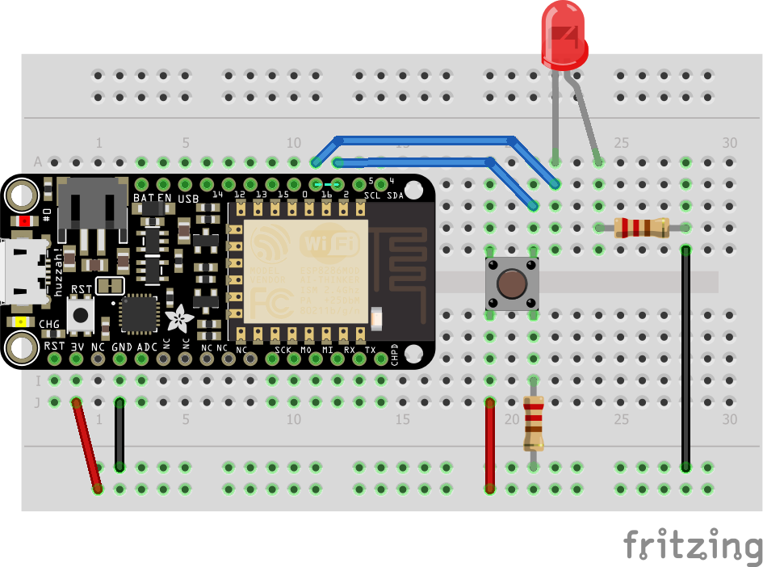

Lecture d'un bouton poussoir
============================

Objectif
--------

Lire l'état d'un bouton poussoir pour commander l'allumage d'une led.

Le montage
----------



À savoir
--------

Nous allons utiliser les functions arduino suivantes:

- **pinMode( pin-number, INPUT )** permet d'indiquer que l'on souhaite utiliser ce port en entrée. Tous les pins de la board peuvent utilisé soit en entrée, soit en sortie.
- **digitalRead( pin-number )** permet de lire le niveau logique (1=HIGH=~3V, 0=LOW=~0V) d'un entrée.
- Notez la présence d'une résistance de *rappel de masse* connecté au bouton poussoir, elle permet de relier l'entrée du micro-controlleur à 0V lorsque le bouton est ouvert sans faire de cours-circuit lorsque le bouton est fermé et que l'entrée est à 3V.

Le code
-------

``` C
#include <Arduino.h>

#define PUSH_BUTTON 2
#define LED_PIN 16

// the setup routine runs once when you press reset:
void setup() {
  // make the pushbutton's pin an input:
  pinMode(PUSH_BUTTON, INPUT);
  pinMode(LED_PIN, OUTPUT);
}

void loop() {
  if( digitalRead(PUSH_BUTTON) ) {
    digitalWrite(LED_PIN, HIGH);
    delay(3000);
    digitalWrite(LED_PIN, LOW);
  } else {
    delay(100);
  }
}
```

Les pistes à explorer
---------------------

Actuellement, la LED reste allumée 3s après une pressions sur le bouton. Saurez-vous modifier le code pour prendre en compte une seconde pression pendant que la LED est allumé pour prolonger le temps d'allumage. L'utilisation de la fonction **millis()** qui permets de connaitres l'heure peut vous aider.


