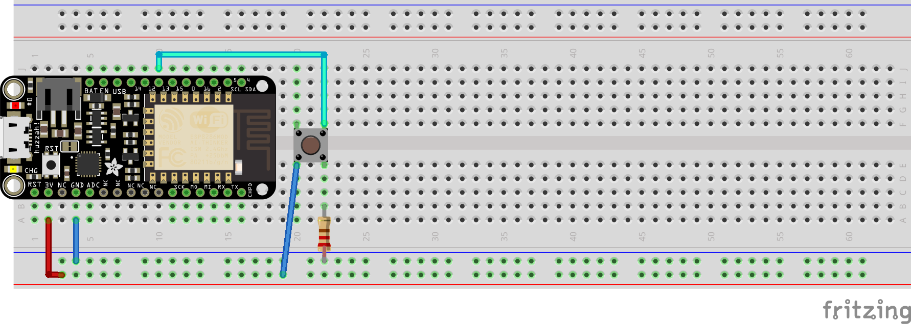

Un client web pour piloter une LED
=

Objectifs
---------

- Communiquer avec un serveur par WiFi
- Découvrir les actions à distance possibles

À savoir
--------

L'ESP8266 possède un module WiFi qui lui permet d'effectuer des actions à distance, selon sa programmation.

Il faut pour cela importer la librairie WiFi relative à l'ESP8266, qui permet d'utiliser le protocole TCP pour envoyer et recevoir des informations.

Ainsi, nous pourrons contrôler l'état d'une LED via une requête HTTP.

Le montage
----------



Le code
-------

```c
#include "Arduino.h"
#include <ESP8266WiFi.h>

#define BUT1  14

const char*   ssid = "WifiPartenaires";
const char*   password = "m3nNUsSe";
const char*   ip = "192.168.56.25";
WiFiClient    client;

String        status;

void setup() {
  // init LED pin
  pinMode(BUT1, INPUT);

  // Connect to the WiFi, see whole code for more infos
}

void loop() {

  // If a button have been pressed, send fresh values to the server
  if (digitalRead(BUT1) == 1) {
    client.connect(ip, 80);
    status == "ON" ? status = "OFF" : status = "ON";
    String  str = String("GET ?/LED=") + status;
    client.println(str);
  }

  delay(200);
}

```


Les erreurs à éviter
-------------------

### Erreur de court-circuit: Oubli de résistance
- Si vous oubliez de mettre une résistance dans le circuit du bouton, vous allez créer un court-circuit lors de la pression de ce dernier !

### Erreur de connexion: Le module WiFi ne se connecte pas
- Vérifiez vos identifiants de connexion.
- Appelez le staff
