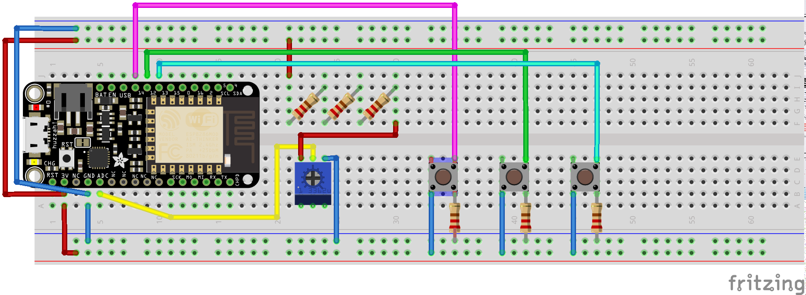

Montage du controlleur de la led RGB (client)
=

Objectif
-

Pouvoir contrôler l'intensité des trois couleurs du serveur LED séparément.

Montage
-



- Le pont de résistances au niveau du potentiomètre permet d'avoir de l'amplitude sur le signal.
Sans ça, la valeur lue atteint trop rapidement le maximum, et le potentiomètre sert de bouton ON/OFF.

- Ne pas oublier les résistances pour les boutons, sans ça, un court circuit est créé lors de la pression.

Le code
-

```c
#include "Arduino.h"
#include <ESP8266WiFi.h>

#define BUT1  14
#define BUT2  12
#define BUT3  13

const char*   ssid = "<SSID>";
const char*   password = "<PWD>";
const char*   ip = "<IP>";
WiFiClient    client;

unsigned int  analog_val;
unsigned int  red_val;
unsigned int  green_val;
unsigned int  blue_val;

void setup() {
  // init LED pin
  pinMode(BUT1, INPUT);
  pinMode(BUT2, INPUT);
  pinMode(BUT3, INPUT);

  // Connect to WiFi, see whole code for more infos
}

void loop() {
  // Read analog value and format it to fill an analogWrite call
  analog_val = analogRead(0);

  // Change color value according to associated button
  if (digitalRead(BUT1) == 1)
    red_val = analog_val;
  if (digitalRead(BUT2) == 1)
    green_val = analog_val;
  if (digitalRead(BUT3) == 1)
    blue_val = analog_val;

  // If a button have been pressed, send fresh values to the server
  if (digitalRead(BUT1) == 1
      || digitalRead(BUT2) == 1
      || digitalRead(BUT3) == 1) {
    client.connect(ip, 80);
    client.println(str);
  }

  delay(200);
}
```

- N'oubliez pas de changer les informations de connexion SSID et password (en tête de code)
et IP (sur le client.connect() dans la fonction loop()) !
- L'IP sera donnée sur la carte serveur.

Explications
-

- On définit les PIN de la carte que nous allons utiliser et on les active en entrée
- On définit les informations de connexion ainsi que l'objet client qui va nous permettre de se connecter au serveur LED
- On définit les variables qui vont stocker les différentes valeurs de nos contrôles


- Dans le setup(), on initie la connexion au WiFi


- Ensuite, lecture de la valeur que nous envoie le potentiomètre
- Attribution de cette valeur à une couleur en fonction du bouton pressé
- Si un bouton est préssé, cela signifie qu'on souhaite modifier une couleur, donc on envoie l'information au serveur
