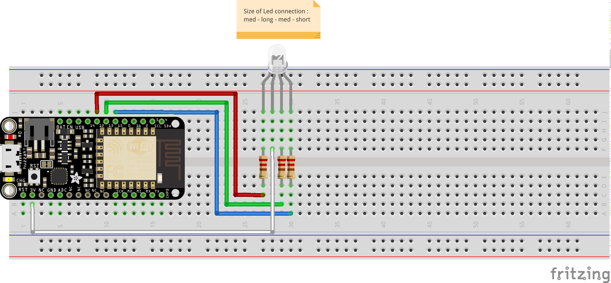

Montage de la led RGB en réception (serveur)
============================================

Objectif
--------

Recevoir les informations envoyées par le controlleur client et les traiter pour faire varier les couleurs de la LED.

Montage
-------



- Sur la LED, la plus grande patte est le +, la moyenne toute seule est le Rouge, l'autre moyenne le Vert, et la plus courte le Bleu.
- Ne pas oublier les résistances, une pour chaque couleur. Cela évite une éventuelle surconsommation électrique.

Le code
-------

```
#include "Arduino.h"
#include <ESP8266WiFi.h>

#define RED_PIN   12
#define GREEN_PIN 13
#define BLUE_PIN  15

const char*       ssid = "<SSID>";
const char*       password = "<password>";
WiFiServer        server(80);

void setup() {
  // init LED pin
  pinMode(RED_PIN, OUTPUT);
  pinMode(GREEN_PIN, OUTPUT);
  pinMode(BLUE_PIN, OUTPUT);

  // init Serial
  Serial.begin(9600);

  Serial.println();
  Serial.println();
  Serial.print("Connecting to ");
  Serial.println(ssid);

  // WIFI connection
  WiFi.begin(ssid, password);
  while (WiFi.status() != WL_CONNECTED) {
    delay(500);
    Serial.print(".");
  }
  Serial.println("");
  Serial.println("WiFi connected");

  // Start the server
  server.begin();
  Serial.println("Server started");

  // Print the IP address
  Serial.print("Use this URL to connect: ");
  Serial.print("http://");
  Serial.print(WiFi.localIP());
  Serial.println("/");

}

void loop() {
  // Check if a client is connected
  WiFiClient client = server.available();
  if (!client) {
    return;
  }

  // Wait until the client sends some data
  Serial.println("new client");
  while(!client.available()){
    delay(1);
  }

  // Read the first line of the request
  String request = client.readStringUntil('\r');
  Serial.println(request);
  client.flush();

  // Get associated value of each color and write it
  int index;
  if ((index = request.indexOf("R=")) != -1) {
    int r = request.substring(index + 2).toInt();
    Serial.print("R="); Serial.println(r);
    analogWrite(RED_PIN, 1023-r);
  }
  if ((index = request.indexOf("G=")) != -1) {
    int g = request.substring(index + 2).toInt();
    Serial.print("G="); Serial.println(g);
    analogWrite(GREEN_PIN, 1023-g);
  }
  if ((index = request.indexOf("B=")) != -1) {
    int b = request.substring(index + 2).toInt();
    Serial.print("B="); Serial.println(b);
    analogWrite(BLUE_PIN, 1023-b);
  }

  // Return the response
  client.println("HTTP/1.1 200 OK\nContent-Type: text/html\n\n<!DOCTYPE HTML>\n<html>\nLed pin has changed ");
  delay(1);
  Serial.println("Client disconnected");
  Serial.println("");
}

```

- N'oubliez pas de changer les informations de connexion (SSID et password) !

Explications
------------

- On définit les PIN de la carte que nous allons utiliser et on les active en entrée
- On définit les informations de connexion ainsi que l'objet client qui va nous permettre de se connecter au serveur LED
- On définit les variables qui vont stocker les différentes valeurs de nos contrôles
- Dans le setup(), on initie la connexion au WiFi
- Ensuite, on attend qu'un client se connecte
- On parse les données qu'il nous envoie pour avoir les composantes R, G et B
- On écrit les valeurs reçues sur les PINs correspondantes
- On répond au client que tout s'est bien passé
