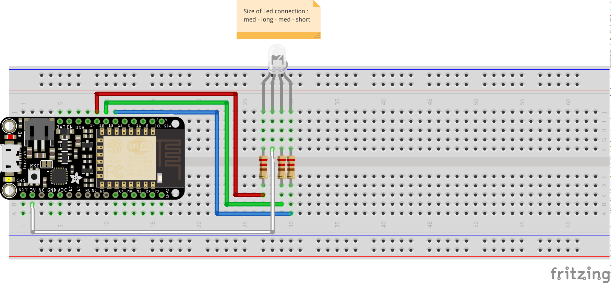

Utilisation d'une led-RGB
=========================

Objectif
--------

Faire un montage pour piloter les 3 couleurs d'une led RGB.

A savoir
--------

- Les leds RGB peuvent être à anode ou cathode commune. Pour cette atelier, nous disposons de led à anode commune (anode = borne +).
- Il faudra donc que le micro controlleur mette la pate correspondante à la masse (LOW) pour allumé la LED, ou à 3v (HIGH) pour éteindre la couleur correspondant.
- Nous utiliserons la fonction **analogWrite( pin-number, value )**, avec une valeur entre 0 et 1023 pour piloter l'intensiter de la couleur (1023 pour éteindre, 0 pour l'allumer).

Le montage
----------



Le code
-------

``` C
#include "Arduino.h"

#define RED_PIN   12
#define GREEN_PIN 13
#define BLUE_PIN  15

void setup() {
  pinMode(RED_PIN, OUTPUT);
  pinMode(GREEN_PIN, OUTPUT);
  pinMode(BLUE_PIN, OUTPUT);
}

int r=0, g=0, b=0;
void loop() {
  r=(r+1)%1024;
  g=(g+2)%1024;
  b=(b-3)%1024;
  analogWrite(RED_PIN, r);
  analogWrite(GREEN_PIN, g);
  analogWrite(BLUE_PIN,b);
  delay(10);
}
```