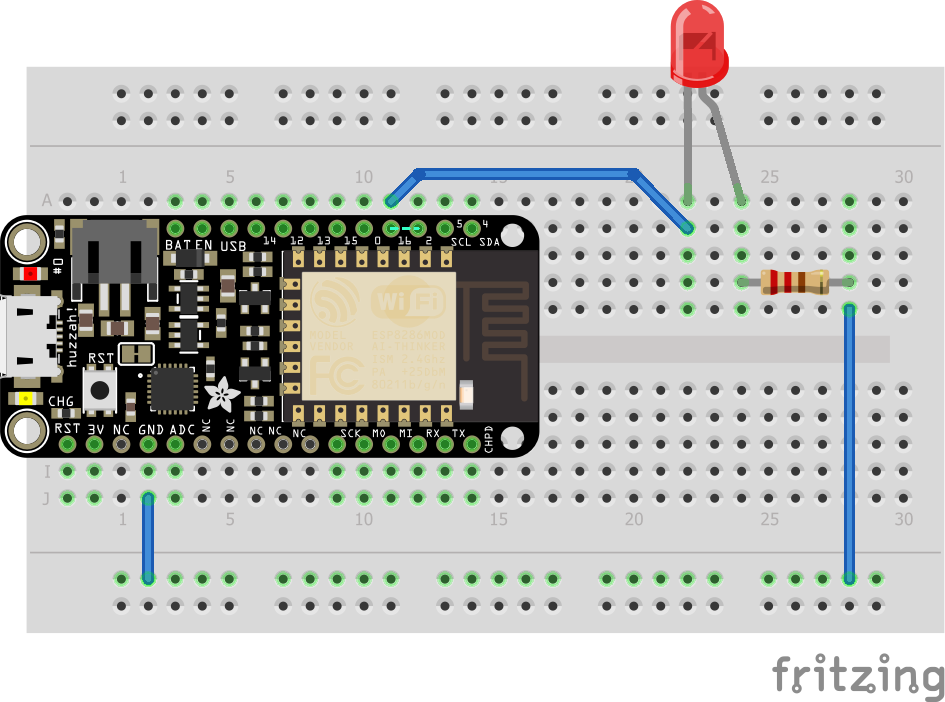

Un serveur web pour piloter une LED
=

Objectifs
---------

- Communiquer avec un serveur par WiFi
- Découvrir les actions à distance possibles

À savoir
--------

L'ESP8266 possède un module WiFi qui lui permet d'effectuer des actions à distance, selon sa programmation.

Il faut pour cela importer la librairie WiFi relative à l'ESP8266, qui permet d'utiliser le protocole TCP pour envoyer et recevoir des informations.

Ainsi, nous pourrons contrôler l'état d'une LED via une requête HTTP.

Le montage
----------

Une led et sa résistance, branchées sur la sortie 16.



Le code
-------

```c
#include "Arduino.h"
#include <ESP8266WiFi.h>

#define LED_PIN 16

const char* ssid = "<wifi-ID>";
const char* password = "<wifi-password>";
WiFiServer server(80);

void setup() {
  // init LED pin
  pinMode(LED_PIN, OUTPUT);

  // init Serial
  Serial.begin(9600);

	// See whole code for more info to connect WiFi
}

void loop() {
  // Check if a client has connected
  WiFiClient client = server.available();
  if (!client) {
    return;
  }

  // Wait until the client sends some data
    while(!client.available()){
    delay(1);
  }

  // Read the first line of the request
  String request = client.readStringUntil('\r');
  client.flush();

  int value = LOW;
  if (request.indexOf("/LED=ON") != -1) {
    digitalWrite(LED_PIN, HIGH);
    value = HIGH;
  }
  if (request.indexOf("/LED=OFF") != -1) {
    digitalWrite(LED_PIN, LOW);
    value = LOW;
  }

  // Return the response
  client.println("HTTP/1.1 200 OK\nContent-Type: text/html\n\n<!DOCTYPE HTML>\n<html>\nLed pin is now: ");
  if(value == HIGH) {
    client.print("On");
  } else {
    client.print("Off");
  }
  client.println("<br><br>\nClick <a href=\"/LED=ON\">here</a> turn the LED on pin 2 ON<br>\nClick <a href=\"/LED=OFF\">here</a> turn the LED on pin 2 OFF<br>\n</html>");

  delay(1);
  Serial.println("Client disconnected");
  Serial.println("");
}

```


Les erreurs à éviter
-------------------

### Erreur de polarité: La LED ne s'allume pas
- Une LED a un sens, sa borne + (cathode) est la plus longue des deux pattes.
- Une LED branchée à l'envers ne s'allume pas (mais n'est pas endommagée), vous pouvez essayer de la retourner.

### Erreur de connexion: Le module WiFi ne se connecte pas
- Vérifiez vos identifiants de connexion.
- Appelez le staff
