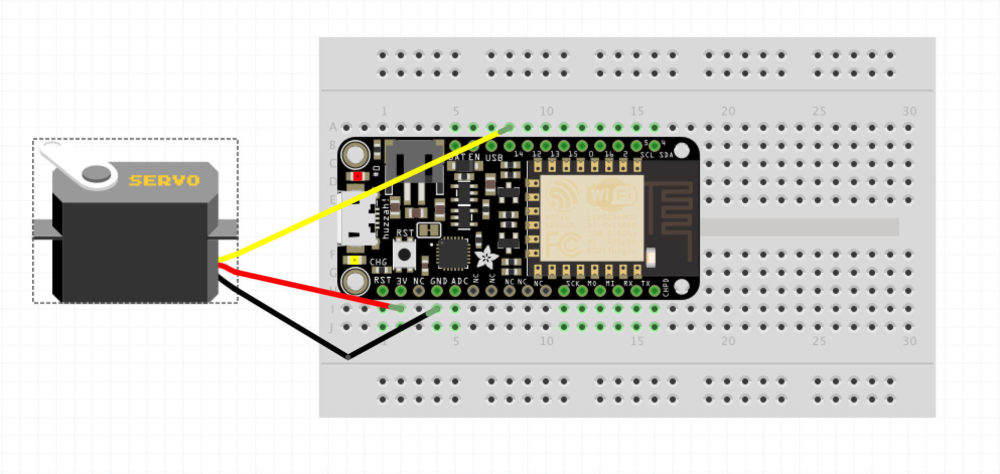

Un serveur web pour piloter un servo moteur
=

Objectifs
---------

- Communiquer avec un serveur par WiFi
- Découvrir les actions à distance possibles

À savoir
--------

L'ESP8266 possède un module WiFi qui lui permet d'effectuer des actions à distance, selon sa programmation.

Il faut pour cela importer la librairie WiFi relative à l'ESP8266, qui permet d'utiliser le protocole TCP pour envoyer et recevoir des informations.

Ainsi, nous pourrons contrôler l'état d'une LED via une requête HTTP.

Le montage
----------

Le Micro servo, branché sur la sortie 14, son alimentation 3v et la masse GND



Le code
-------

```c
#include <Servo.h>
#include <ESP8266WiFi.h>
#include <ESP8266WebServer.h>

const char* ssid = "<wifi-ID>";
const char* password = "<wifi-password>";

ESP8266WebServer server(80);

Servo myservo;

void setup(void)
{
  Serial.begin(9600);
  Serial.println("");

  WiFi.begin(ssid, pass);
  // Wait for connection
  while (WiFi.status() != WL_CONNECTED)
  {
    delay(500);
    Serial.print(".");
  }

  Serial.println("");
  Serial.print("Connected to ");
  Serial.println(ssid);
  Serial.print("IP address: ");
  Serial.println(WiFi.localIP());

  server.on("/", []()
  {
    server.send(200, "text/plain", "Open /servo?value=90 to control servo");
  });

  server.on("/servo", []()
  {
    String sval = server.arg("value");
    int ival = sval.toInt();
    Serial.print("Servo: ");
    Serial.println(ival);
    myservo.attach(14);
    myservo.write(ival);
    server.send(200, "text/plain", String(ival, DEC));
  });

  server.begin();
  Serial.println("HTTP server started");

}

void loop(void)
{
  server.handleClient();
}

```


Les erreurs à éviter
-------------------

### Erreur: Le Micro servo ne marche pas
- Vérifier les branchement.


### Erreur de connexion: Le module WiFi ne se connecte pas
- Vérifiez vos identifiants de connexion.
- Appelez le staff
