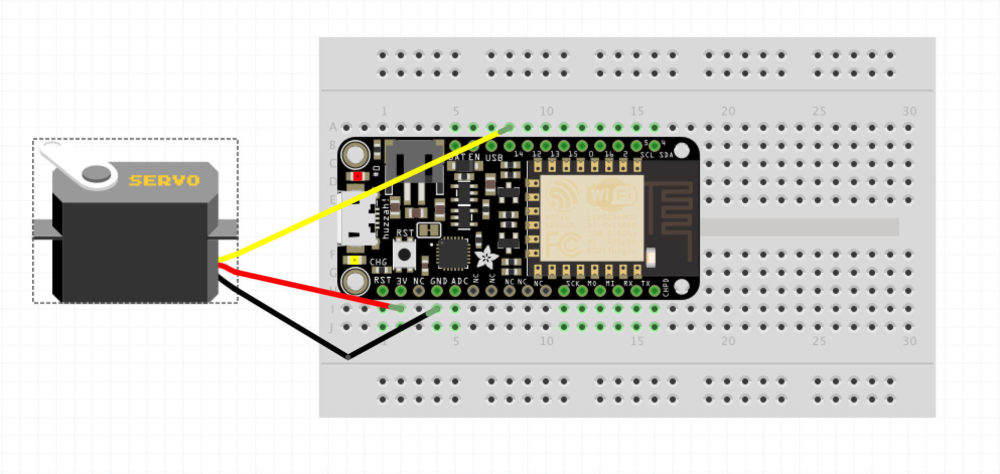

Mon premier montage: Bouge ton servo
========================================

Objectifs
---------

- Faire un premier montage sur la breadboard
- Découvrir la programmation d'un arduino
- Utiliser le Micro Servo
À savoir
--------

L'ESP8266 peut être programmé de la même manière qu'un arduino, c'est ce que nous allons faire ici avec un premier programme basique. La documentation liée à arduino étant très importante sur Internet, il est généralement très facile de trouver des codes d'exemple pour la majorité des montages simple.

Concrètement, un programme arduino est un programme en C/C++ qui importe "Arduino.h" et qui se compose de deux fonctions:

- **setup()** qui sera exécutée une fois au démarrage du micro-controlleur. C'est-à-dire, lors de sa mise sous tention ou d'un reset.
- **loop()** qui sera appelée en boucle une fois la fonction **setup()** terminée.

L'ESP8266 dispose de plusieurs entrée/sorties (aussi appelées GPIO) numérotées que l'on va pouvoir programmer. Les fonctions utiles:

**Servo.h** Cette librairie permet de contrôler les servomoteurs. Les servomoteurs intègrent un mécanisme et un axe qui peut-être contrôlé précisément. Les servomoteurs standards permettent de positionner l'axe à différents angles, habituellement entre 0 et 180 degrès.

Le montage
----------

Le Micro servo, branché sur la sortie 14, son alimentation 3v et la masse GND



Le code
-------

``` C
#include <Servo.h>

Servo myservo;

int pos = 0;         // variable to store the read value

void setup()
{
  myservo.attach(14);
}

void loop()
{
  for(pos = 0; pos < 180; pos += 1)  // goes from 0 degrees to 180 degrees
  {                                  // in steps of 1 degree
    myservo.write(pos);              // tell servo to go to position in variable 'pos'
    delay(15);                       // waits 15ms for the servo to reach the position
  }
  for(pos = 180; pos>=1; pos-=1)     // goes from 180 degrees to 0 degrees
  {
    myservo.write(pos);              // tell servo to go to position in variable 'pos'
    delay(15);                       // waits 15ms for the servo to reach the position
  }
}

```

Les erreurs à éviter
-------------------

### Erreur: Le Micro servo ne marche pas
- Vérifier les branchement.
