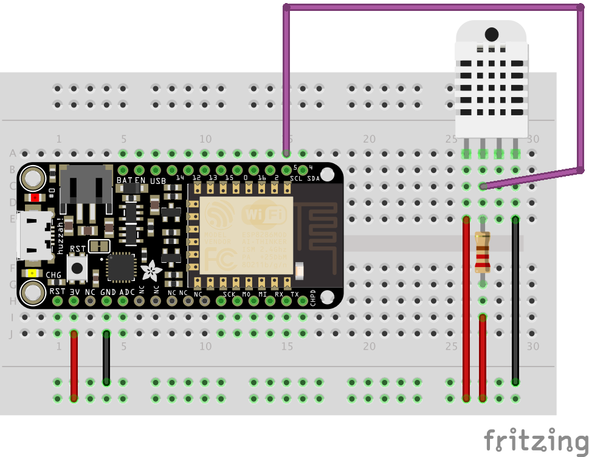

Utilisation d'une librairie externe pour un composant évolué
============================================================

Objectif
--------

Ce projet a pour but d'utiliser une librairie externe pour utiliser simplement
des composants évolués, comme une sonde de température et humidité. Lorsqu'un
client requête l'objet sur son addresse IP, ce dernier récupère la
température et l'humidité, génère une page HTML et la renvoi au client.

À savoir
--------

- À la création d'un projet sous PlatformIO, un dossier `lib` contenant un fichier `readme.txt` est aussi créé!

Ajouter une librairie
---------------------------------------------

Pour le projet de capteur de température, il suffit de récupérer la librairie
[DHT22](https://github.com/adafruit/DHT-sensor-library) sur github.
Le projet doit impérativement être structuré de la façon suivante:

```
project (temperature_sensor)
  |_ lib
    |_ <library_name> (DHT)
      |_ src
        |_ <library_name>.c (DHT.c)
        |_ <library_name>.h (DHT.h)
  |_ src
    |_ ... (Temperature.cpp)
```

Il suffit ensuite d'inclure le fichier .h dans le code source du projet (Temperature.cpp):

```c
// #include <<library_name>.h>
#include <DHT.h>
```

Le montage
----------



Le code
-------

```c
// Le type du capteur
#define DHTTYPE DHT22
// Le port dédié à la sonde de température sur le board
#define DHTPIN 5
// Initialisation du capteur
DHT dht(DHTPIN, DHTTYPE);
```

```c
void setup() {
  dht.begin();
}
```

```c
void loop() {
  // Récupérer les valeurs du capteur
  float h = dht.readHumidity();
  float t = dht.readTemperature();
  
  // Vérifier si les données sont valides
  if (isnan(h) || isnan(t)) {
    return;
  }
  
  // Afficher le résultat
  Serial.println(h);
  Serial.println(t);
}
```

L'utilisation
-------------

Le code final transmet les données captées par le composant sur le réseau via
une page HTTP. Après avoir modifié le SSID et le PASSWORD avec des paramètres
wifi valides, il suffit de compiler et d'uploader le code sur le board. Au
lancement, le code affiche l'IP du device sur la console série (attention au
baudrate!), en tapant cet IP sur un navigateur (ou en utilisant cURL), nous
sommes en mesure de récupérer les informations de température et d'humidité.
