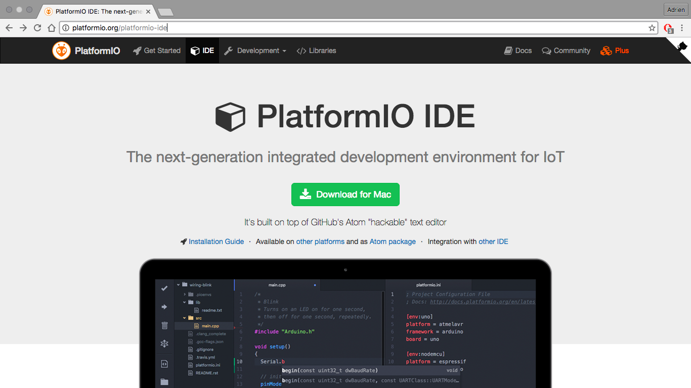
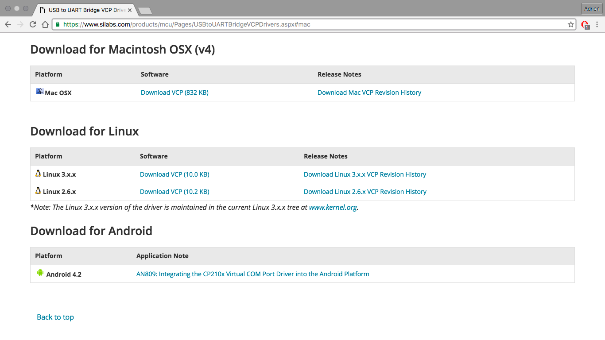
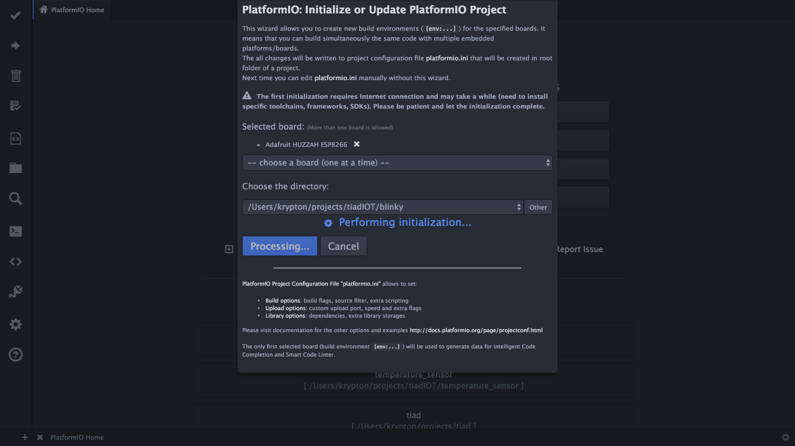
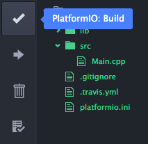
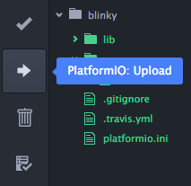
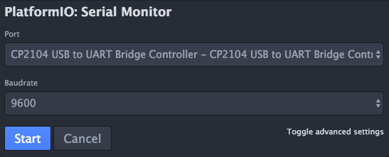

Installing environment for MacOS
================================

Installing IDE
--------------

Download link: http://platformio.org/platformio-ide#



Installing driver
-----------------

Download link: https://www.silabs.com/products/mcu/Pages/USBtoUARTBridgeVCPDrivers.aspx#mac

This driver is required to connect the board to the serial port of the computer. Follow the installation process, notice that root password may be required.



First application
-----------------

On the main page of the IDE, create a `New Project`.

Select the board `Adafruit HUZZAH ESP8266`, select a directory for the code and click on `Process`. This may take a while at the first launch, because the IDE has to download some drivers.



Connecting the board
--------------------

- In the folder `src`, create an empty application in `Main.cpp`:

```
/*
 * Empty project
 */

#include "Arduino.h"

void setup() {}

void loop() {}
```

- Connect the Adafruit mainboard throught USB.

- Compile the project: 



- Send the project to the board:



```
Your project is now running on the board!
```

Receiving data from the board
-----------------------------

This step is achieved by getting the serial port of the board ( ~ board console).

- Open the serial monitor interface:


- Configure the serial port:



You must choose the correct port, and the correct `baud rate`. For this application you can stay on 9600. Click on `Start`, you're now connected to the board.

```
If no errors occured, your setup is correct and you are ready to work.
```
