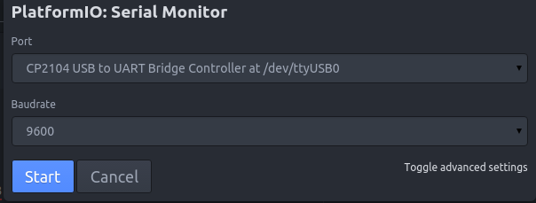

Premiers pas avec l'ESP8266 sous Linux
======================================

Connecter le micro controleur
------------------------

Connectez le micro controleur (MC) à votre ordinateur

Appliquer les permissions de lecture et d'écriture pour tout le monde sur le MC
- Pour savoir quel est le le port USB utilisé, cliquez sur le bouton Serial Monitor,
sur le panneau latéral gauche, troisième en partant du bas
- Si vous avez plusieurs périphériques USB connectés, vous pouvez trouver le MC
en le branchant/débranchant, et en vérifiant lequel est parti de la liste entre
temps
- Allez dans le répertoire /dev et changez les permissions
 - Ctrl + Alt + T (Ouvrir le terminal)
 - sudo chmod 666 /dev/ttyUSBX (Pour changer les permissions : rw-rw-rw,
où X est le numéro de port utilisé)
 - N.B. Vous devez effectuer cette commande à chaque fois que vous rebranchez
votre MC

Maintenant vous pouvez téléverser (upload) votre projet !

Première application
--------------------

Sur la page principale de l'IDE platformIO, créer un nouveau projet (`New Project`).

Sélectionner le board `Adafruit HUZZAH ESP8266`, choisir un emplacement pour le projet et cliquer sur `Process`. Cela peut prendre du temps au premier lancement, car l'IDE a besoin de télécharger des drivers pour le board.


Connecter le board
------------------

1) Dans le dossier `src`, créer une nouvelle application vide dans `Main.cpp`:

```C
/*
 * Empty project
 */

#include "Arduino.h"

void setup() {}

void loop() {}
```

2) Connecter le board Adafruit en USB.

3) Compiler le project:


4) Uploader le projet sur le board:


```
Le projet est maintenant exécuté sur le board!
```

Recevoir des données du board
-----------------------------

Cette étape est réalisée en recevant les données du port série du board (~ terminal du board).

- Ouvrir le moniteur série:


- Configurer le port série:



Il faut choisir le bon port et le bon `baud rate`. Pour cette application, nous pouvons rester sur 9600 baud. Cliquer sur `Start` pour vérifier que vous êtes bien connecté au board.

```
Si aucune erreur n'est apparue, l'installation est fonctionnelle est vous êtes prêt à programmer!
```
