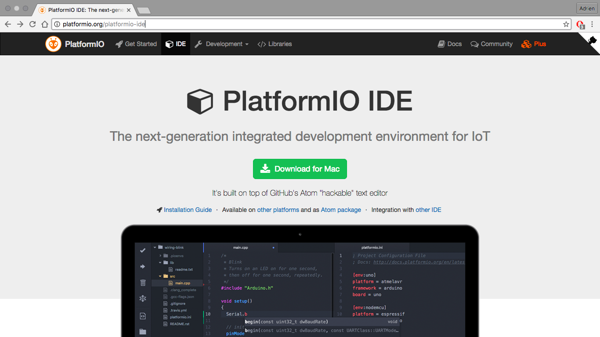
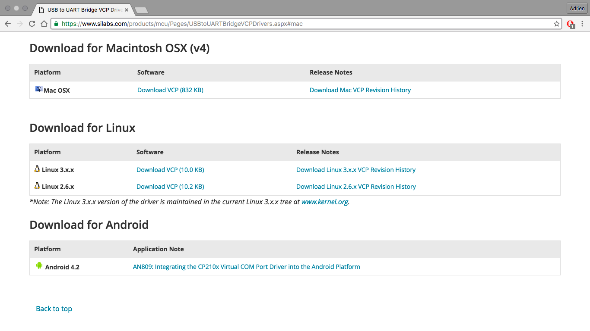

Installation de l'environnement sous MacOS
==========================================

Télécharger l'IDE
-----------------

Lien: http://platformio.org/platformio-ide#

Télécharger le driver
---------------------

Lien: https://www.silabs.com/products/mcu/Pages/USBtoUARTBridgeVCPDrivers.aspx#mac

Le driver est nécessaire pour se connecter sur le port série de l'ESP8266. Le
processus d'installation est standard, mais le mot de passe root peut être
requis.

Next
----

Vous êtes maintenant prêt à travailler, et à essayer le
[first step](first_step-macos.md).
