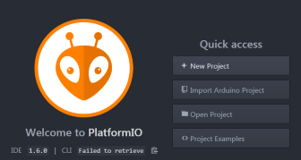
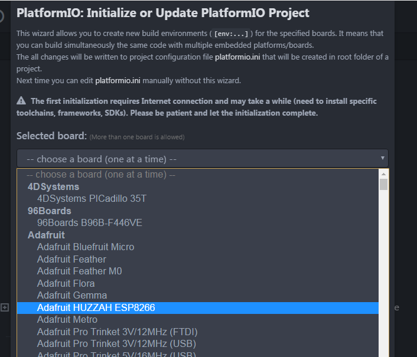

Installer l'environnement de travail pour Ubuntu
========================

Installer l'IDE
--------------

### Platform IO

Lien d'installation : http://platformio.org/platformio-ide#other-platforms

Pour commencer : http://docs.platformio.org/en/stable/ide/atom.html#installation

### C-Lang 

Utilisez votre gestionnaire de packets préféré pour installer **clang**.
	apt-get install clang
or
	yum install clang.

	
Installation du compilateur pour Huzzah
---------------------------------------

La dernière étape de l'installation consiste à créer un projet dans platformIO en selectionnant la carte Huzzah d'AdaFruit pour qu'il télécharge automatiquement le compilateur et ses dépendances.

Select **New project**:

Select **Huzzah** dans **AdaFruit**:

Next
----

Vous êtes maintenant prêt pour l'atelier.

Il est temps de brancher votre ESP et de faire vos [premiers pas](first_step-linux.md).