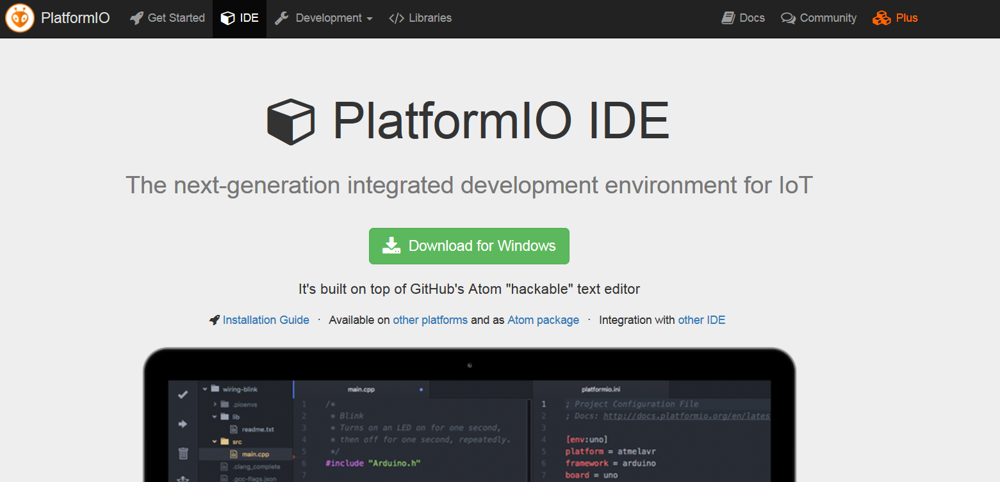
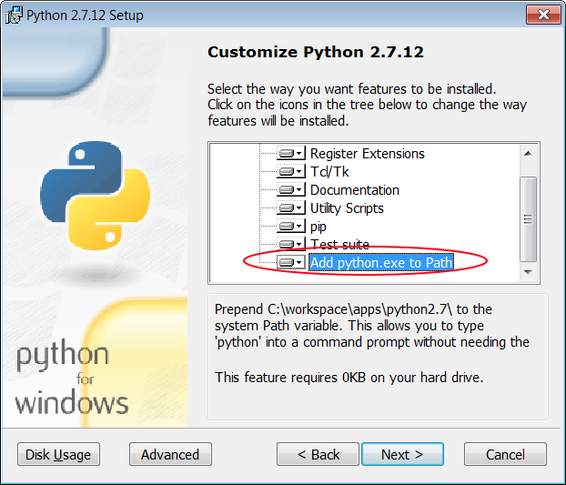

Installation de l'environnement pour Windows
============================================

Télécharger l'IDE
-----------------

### Platform IO

Lien : http://platformio.org/platformio-ide

### Python 2.7

PlatformIO est écrit en python mais celui-ci doit-être installé séparément.

Lien: https://www.python.org/downloads/

Attention lors de l'installation de l'installation, il faut ajouter python.exe au PATH pour que platformIO puisse le trouver sans problème.

### C-Lang 3.9.0

Lien: http://llvm.org/releases/download.html

Télécharger le driver
---------------------

La breakboard AdaFruit Huzzah nécessite un driver pour Windows.

Lien: https://learn.adafruit.com/adafruit-arduino-ide-setup/windows-setup

Next
----

Vous êtes maintenant prêt pour l'atelier.

Il est temps de brancher la board et de faire ses [premiers pas](first_step-windows.md).
